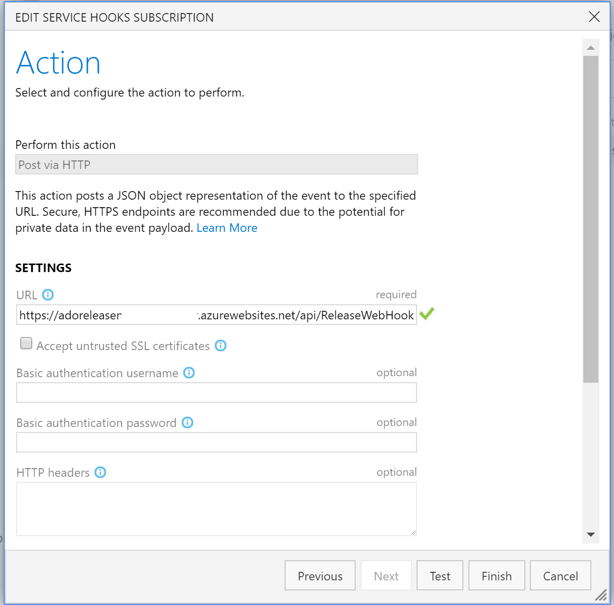

# Azure DevOps Release Notes Generator

A release notes generator for Azure DevOps.

## Features

_Rendered markdown file of example release notes_

The generator is a [function app](https://docs.microsoft.com/en-us/azure/azure-functions/functions-overview?WT.mc_id=demo-functions-jasmineg) containing a [HTTP triggered function](https://docs.microsoft.com/en-us/azure/azure-functions/functions-bindings-http-webhook#trigger?WT.mc_id=demo-functions-jasmineg) that creates a Markdown file whenever a new release is created in Azure DevOps, using [Azure Blob Storage](https://azure.microsoft.com/en-us/services/storage/blobs?WT.mc_id=demo-functions-jasmineg).

## Prerequisites
- [Azure](https://azure.microsoft.com/en-us/free?WT.mc_id=demo-functions-jasmineg) account.
- [Azure DevOps Project](https://docs.microsoft.com/en-us/azure/devops/organizations/projects/create-project?WT.mc_id=demo-functions-jasmineg)
- [Azure Storage Explorer](https://docs.microsoft.com/en-us/azure/vs-azure-tools-storage-manage-with-storage-explorer?WT.mc_id=demo-functions-jasmineg)
- [Visual Studio](https://visualstudio.microsoft.com/downloads/)
- [Azure Functions and WebJob Tools for Visual Studio](https://docs.microsoft.com/en-us/azure/azure-functions/functions-develop-vs#update-your-tools?WT.mc_id=demo-functions-jasmineg)

## Visual Studio Quickstart

The following tutorial shows how to run locally and deploy the function app via Visual Studio.

### Running Locally in Visual Studio
1. Clone this repo and open the project in Visual Studio.
2. Rename **dev.settings.json** to **local.settings.json** and update the settings. Refer to the [application settings table](#Application-Settings) for details. You can ignore  `AzureWebJobsStorage`, `AzureWebJobsStorage`. Leave `StorageAccountConnectionString` as is to work with the local storage account in Storage Explorer.
3. In the Storage Explorer, open **Local And Attached** > **Storage Accounts** > Right click on **Blob Containers** >  **Create Blob Container**. Enter the name `releases`
4. In your command line interface of choice, execute ngrok command `ngrok http 7071`. Leave open for the remainder of local development.
5. [Follow the instructions](#Configure-Azure-DevOps-Webhook) to create a webhook in Azure DevOps and paste the generated ngrok url so that it reads `http://___.ngrok.io/api/ReleaseNotesWebHook`
6. Run the app with F5
7. You can test the function without making a new release by editing the webhook, clicking **Next** to go to the Action dialog, then **Test**.
8. Check your `releases` container to find generated release notes.

### Deploy to Azure from Visual Studio

You'll need a tool that exposes your local function to Azure DevOps. This quickstart uses [ngrok](https://ngrok.com/download).

1. Clone this repo and open the project in Visual Studio.
2. In Solution Explorer, right-click the project, then click **Publish**.
3. On the right of the publish dialog, select **Azure Function App**, choose Create New, and then click **Create Profile**.
4. Connect your Azure account to Visual Studio if you haven't already. When connected, fill out the application hosting settings. Refer to the table for host settings:

| Setting      | Suggested value  | Description                                |
| ------------ |  ------- | -------------------------------------------------- |
| **App Name** | Default value | Name that uniquely identifies your new function app. |
| **Subscription** | Choose your subscription | The Azure subscription to use. |
| **Resource Group** | releasenotesgroup | Choose **New** to create a new resource group.|
| **App Service Plan** | Consumption plan | Make sure to choose the **Consumption** under **Size** after you click **New**. Also, choose a **Location** in a region near you or near other services your functions access. |
| **Storage Account** | Default value | An Azure storage account is required by the Functions runtime. Click **New** to create a general purpose storage account. You can also use an existing account. |

_Publishing from Visual Studio_

5. Click **Create Storage Account** and follow the account dialog to set your storage account name. Make sure the **Account Type** is Standard. Click **Ok**.
6. In the publish dialog click **Create**

### Configure Function App Settings

1. When deployment is completed, you'll be directed to a view of of your new function app's details. Click on **Manage Application Settings**.
2. Refer to the table below to configure your application settings:

#### Application Settings 
| Setting      | Location   | Description                                |
| ------------ |  ----------- | -------------------------------------------------- |
| **StorageAccountConnectionString** | Highlight created storage account in Azure Storage Explorer, locate its properties at the bottom left, labeled **Primary Connection String** | Keys and other information required to establish a connection to a storage account |
| **OrganizationURL** | Browser address bar | Url of your Azure DevOps Organization: _https://dev.azure.com/orgname/_ |
| **AccessToken** |  In Azure DevOps: On the top right of project, click on your profile then **Security** > **Access Tokens** > **+ New Token**. Set Read permissions on **Code** and **Work Items**. For more detailed instructions, visit [Create personal access tokens to authenticate access](https://docs.microsoft.com/en-us/azure/devops/organizations/accounts/use-personal-access-tokens-to-authenticate#create-personal-access-tokens-to-authenticate-access?WT.mc_id=demo-functions-jasmineg).  | Required authorization token to access project information.  |
| **ProjectName** | Azure DevOps Project | Name of the project to generate release notes from.  |
| **Username** | Azure DevOps profile, usually an email address. | Username for Azure DevOps. |

3. Click **Ok** then copy the **Site URL**. Save for later.

### Create a Blob Container
1. In Azure Storage Explorer, expand the newly created storage account.
2. Right click on **Blob Containers** > **Create Blob Container** and enter the name `releases`

### Configure Azure DevOps Webhook
1. In your Azure DevOps project, select the project you'd like to generate notes from. On the bottom left hand side, open **Project Settings**.
2. To the left of the settings, select **Service hooks**. Click the green button to add a new webhook.
3. In the dialog, select **Web Hooks**, click **Next**.
4. In the next dialog, select **Release created** from the dropdown, click **Next**.

3. Paste, then update the copied url by so that it reads `https://functionappname.azurewebsites.net/api/ReleaseNotesWebHook`.
4. Click **Finish** to save your changes.

### Test the application
Create a new release in Azure DevOps to generate notes. You can also test the function without making a new release by editing the webhook, clicking **Next** to go to the Action dialog, then **Test**. Check your `releases` container to find generated release notes.

## Resources
- [Overview of Azure DevOps Project](https://docs.microsoft.com/en-us/azure/devops-project/overview?WT.mc_id=demo-functions-jasmineg)
- [Develop Azure Functions using Visual Studio](https://docs.microsoft.com/en-us/azure/azure-functions/functions-overview?WT.mc_id=demo-functions-jasmineg)
- [Azure Functions Documentation](https://docs.microsoft.com/en-us/azure/azure-functions/functions-overview?WT.mc_id=dotnet-blog-jasmine)
- [Code and test Azure Functions Locally](https://docs.microsoft.com/en-us/azure/azure-functions/functions-develop-local?WT.mc_id=demo-functions-jasmineg)
- [WebHooks with Azure DevOps Services](https://docs.microsoft.com/en-us/azure/devops/service-hooks/services/webhooks?WT.mc_id=demo-functions-jasmineg)
- [Quickstart: Use .NET to create a blob in object storage](https://docs.microsoft.com/en-us/azure/storage/blobs/storage-quickstart-blobs-dotnet?WT.mc_id=demo-functions-jasmineg)
- [Get started with Storage Explorer](https://docs.microsoft.com/en-us/azure/vs-azure-tools-storage-manage-with-storage-explorer?WT.mc_id=demo-functions-jasmineg)
